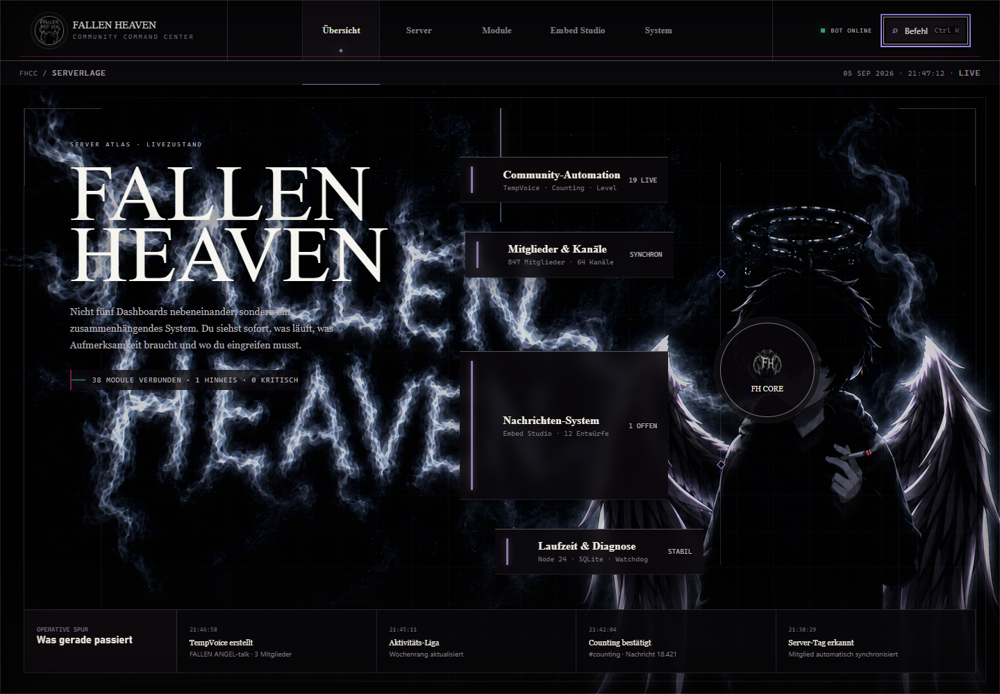
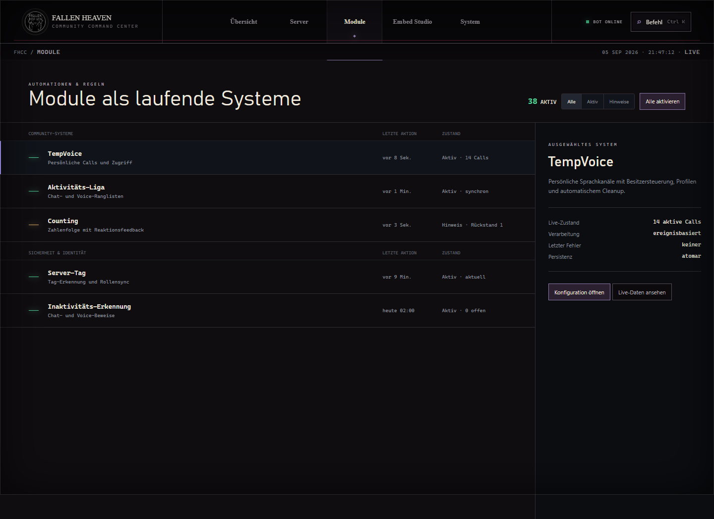
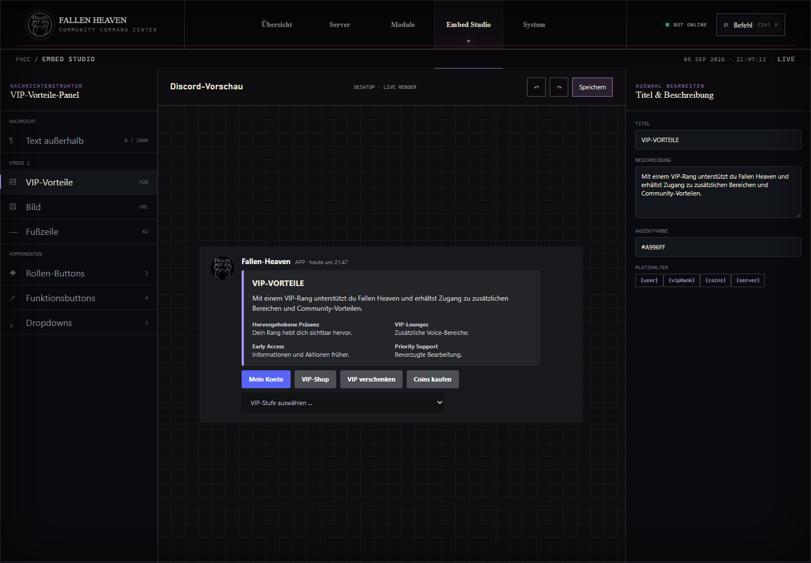
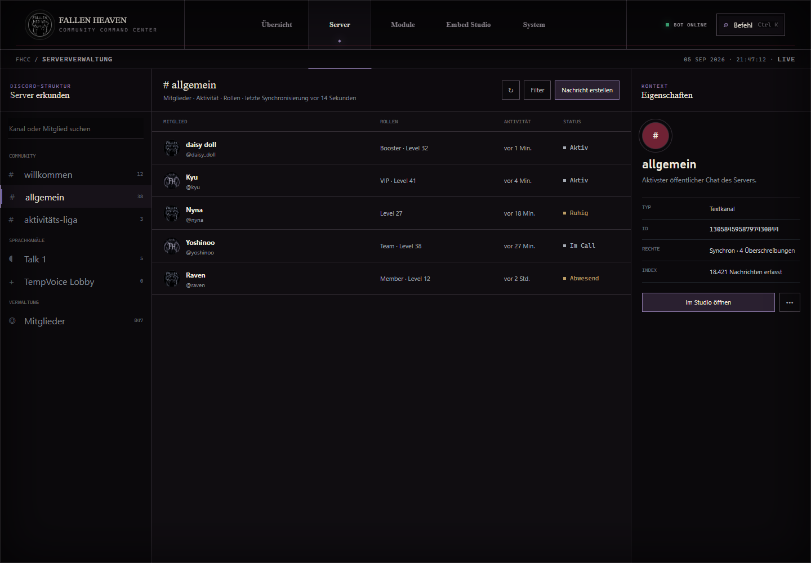
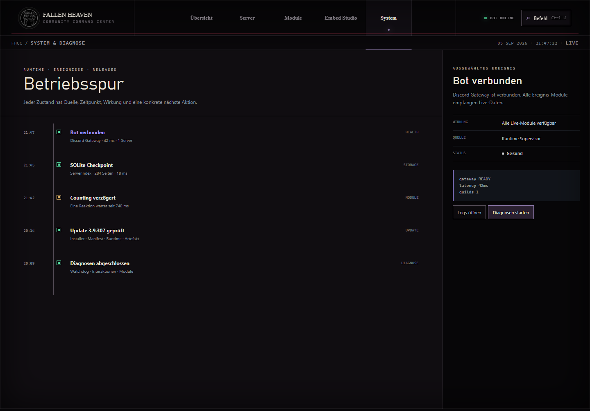
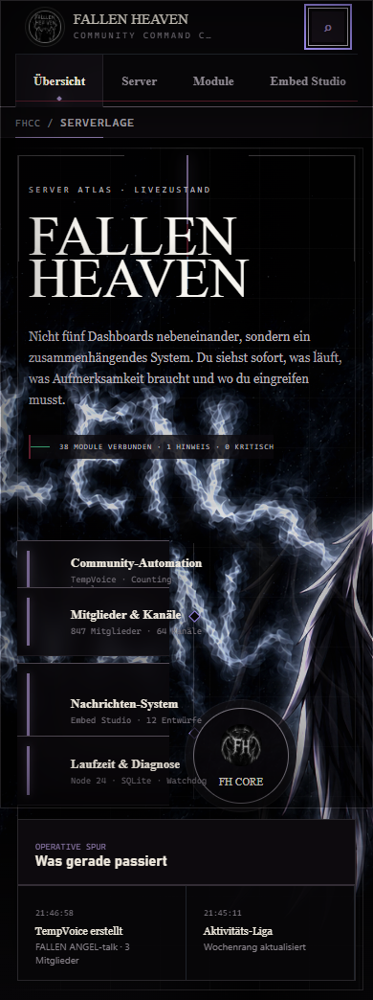

<div align="center">


# FALLEN HEAVEN Control Center

**Die native Discord-Schaltzentrale für Windows und Linux.**

Bot-Steuerung, Content Studio, Serververwaltung, Economy, Moderation und Diagnose –
in einer einzigen Desktop-App statt in einem Dutzend Browser-Tabs.

[](https://github.com/fallenangelsys/fhcc-releases/actions/workflows/release.yml)
[](https://github.com/fallenangelsys/fhcc-releases/actions/workflows/ci.yml)


[**Releases**](https://github.com/fallenangelsys/fhcc-releases/releases) ·
[**Changelog**](bot-changelog.json) ·
[**Dokumentation**](docs/)

</div>

---

## Inhalt

- [Was ist FHCC](#was-ist-fhcc)
- [Oberfläche](#oberfläche)
- [Funktionen](#funktionen)
- [Installation](#installation)
- [Updates](#updates)
- [Architektur](#architektur)
- [Entwicklung](#entwicklung)
- [Qualitätssicherung](#qualitätssicherung)
- [Sicherheit und Datenschutz](#sicherheit-und-datenschutz)
- [Projektstruktur](#projektstruktur)

---

## Was ist FHCC

FHCC ist eine Electron-Desktop-App, die einen Discord-Bot, ein lokales Dashboard
und alle Verwaltungsfunktionen in einer nativen Oberfläche bündelt. Der Bot läuft
als **eigener, überwachter Prozess** – kein zweiter Discord-Client, keine
Konsole, kein Docker-Setup.

| | |
|---|---|
| **Oberfläche** | Electron 43, eigenes Designsystem, Dark und Light Mode |
| **Bot** | discord.js 14, lokaler Express-5-Dienst auf `127.0.0.1` |
| **Speicher** | SQLite 13 (Node-API-Prebuilds), atomare JSON-Stores |
| **Module** | 33 Feature-Module in `src/features/` |
| **Tests** | Über 80 Smoke-Suiten, gebündelt in `npm run test:release` |
| **Pakete** | Windows NSIS-Installer, Linux AppImage, Linux `.deb` |

Die App startet **nie von allein**, wenn sie auf einem fremden oder frisch
übernommenen Datenordner läuft. Der Startmodus ist bewusst konservativ: Der Bot
läuft erst, wenn er eingerichtet ist **und** der Start ausdrücklich erlaubt wurde.

---

## Oberfläche

<div align="center">



<br><br>




<br><br>




<br><br>



</div>

---

## Funktionen

### Steuerung und Betrieb

- **Prozess-Supervisor** mit Health-Heartbeat, Port-Reservierung und Watchdog – ein belegter Port `3000` startet keinen zweiten Bot, sondern löst eine sichere Ersatzport-Reservierung aus
- **Startmodi** *Automatisch* und *Erst manuell starten*, inklusive Frischinstallations-Erkennung
- **System Center** mit Live-Diagnose, geschwärzten Protokollen, Speicherinventar und Datenumzug auf einen anderen Rechner

### Module

| Bereich | Module |
|---|---|
| **Moderation** | Filter, Wort-Bann, Raid-Schutz, Verwarnungen, Mitgliederverifikation |
| **Community** | Tickets, Willkommen und Abschied, Abstimmungen, Zähler, Forum-Cleaner |
| **Content** | Embed Studio mit Live-Vorschau, Reaktionsrollen, Emoji-Manager, Steam-Workshop-Katalog |
| **Voice** | Temporäre Voice-Kanäle mit Nutzerprofilen, Voice-Chat-Cleaner, Voice-Log-Import |
| **Economy** | Coins, Boosts, VIP-Panels, Leveling, Aktivitäts-Liga, Inaktivitäts-Erinnerungen |
| **Server** | Kanalreihenfolge, Server-Tags, Rollen-Saver, Rollen-Tausch, Auto-Rollen |

### Dashboard

- Lokale HTML-Oberfläche auf `127.0.0.1:3000`, ausschließlich an Loopback gebunden
- **Discord-OAuth im echten Systembrowser** – niemals in einem eingebetteten WebView
- **Serverindex** mit Keyset-Cursor-Paginierung statt vollständiger Vollabfragen
- Reaktionsrollen-Buttons, Boost-Ankündigungen und Studio-Designs als persistente Entwürfe

### Datenumzug

Das verschlüsselte `.fhccbackup`-Exportformat überträgt Serverdaten, Bilder,
Embed-Entwürfe, Einstellungen und Zugangsdaten verlustfrei auf einen anderen
Rechner. Der Import ist transaktional: Erst wenn Daten **und** Oberfläche
übernommen sind, gilt er als abgeschlossen – andernfalls bleibt der alte
Arbeitsstand unangetastet.

---

## Installation

### Windows (x64)

1. `FHCC-Setup-<version>-x64.exe` aus den [Releases](https://github.com/fallenangelsys/fhcc-releases/releases) herunterladen
2. Installer ausführen – der Zielordner ist fest gesetzt
3. Beim ersten Start öffnet sich die Einrichtung: Bot-Token oder OAuth-Zugangsdaten eintragen

### Linux (x64)

**AppImage** – keine Installation, kein Root:

```bash
chmod +x FHCC-<version>-x86_64.AppImage
./FHCC-<version>-x86_64.AppImage
```

**Debian und Ubuntu (`.deb`):**

```bash
sudo apt install ./FHCC-<version>-amd64.deb
```

Die Dateinamen im Release folgen der Linux-Architektur (`x86_64` für das
AppImage, `amd64` für das Debian-Paket), nicht der Bezeichnung `x64`.

Voraussetzungen für eine Linux-VM:

| Anforderung | Detail |
|---|---|
| **Desktop** | Grafische Sitzung erforderlich – FHCC ist eine Desktop-Anwendung |
| **Schlüsselbund** | GNOME Keyring oder KDE Wallet; der unsichere `basic_text`-Fallback wird abgelehnt |
| **Netz** | Zugriff auf `discord.com` und die Discord-API |
| **OAuth** | Im Discord Developer Portal exakt `http://127.0.0.1:3000/api/auth/discord/callback` als Redirect-URI eintragen |

---

## Updates

Windows-Versionen aktualisieren sich über den Release-Kanal der App
(*System → App Updates*). Der Ablauf ist durchgeprüft:

1. `latest.yml` wird gelesen – **Version und SHA-512**, bevor der Download startet
2. Ein Installer ohne passenden Hash wird verworfen, Größenabweichungen über 1 MB abgelehnt
3. Der geprüfte Installer startet still, entfernt die Vorversion selbst und prüft das Ergebnis

```
FHCC-Setup-<version>-x64.exe           Windows-Installer
FHCC-Setup-<version>-x64.exe.blockmap  Differentialdaten
latest.yml                             Version, Größe, SHA-512
FHCC-<version>-x86_64.AppImage         Linux AppImage
FHCC-<version>-amd64.deb               Linux Debian und Ubuntu
```

Linux-Versionen werden manuell aktualisiert: neues AppImage oder `.deb` einspielen.
Der GitHub-Token für private Release-Repositories wird über den
Betriebssystem-Schlüsselbund verschlüsselt und verlässt die Electron-Brücke nie.

---

## Architektur

```
┌──────────────────────────────────────────────────────────┐
│  Electron-Hauptprozess (desktop/main.cjs)                │
│  Fenster · IPC-Brücke · Update-Kanal · Prozessaufsicht    │
└──────────────┬───────────────────────────────────────────┘
               │ IPC (contextIsolation, sandbox)
┌──────────────▼───────────────────────────────────────────┐
│  Renderer (desktop/renderer/)                            │
│  Command Deck · Module · Studio · System Center          │
└──────────────┬───────────────────────────────────────────┘
               │ HTTP 127.0.0.1:3000 + Control-Token
┌──────────────▼───────────────────────────────────────────┐
│  Bot-Prozess (src/index.js, eigener Node-Prozess)       │
│  discord.js · Express-Dashboard · SQLite · 33 Module    │
└──────────────────────────────────────────────────────────┘
```

Der Bot läuft als **getrennter Prozess**. Fällt er aus, erkennt das die App über
einen Health-Heartbeat; stirbt er unerwartet, übernimmt der Watchdog den Neustart.
Schreibzugriffe auf Konfiguration laufen ausschließlich über atomare Stores mit
Backup und Recovery.

---

## Entwicklung

```bash
npm ci          # Abhängigkeiten installieren
npm start       # App im Entwicklungsmodus starten
```

Für den Discord-Login werden `DISCORD_CLIENT_ID`, `DISCORD_CLIENT_SECRET` und die
Callback-URI aus [.env.example](.env.example) benötigt. Bot-Token und andere
Secrets gehören ausschließlich in `.env` oder in den geschützten App-Speicher –
niemals in den Quellcode.

| Befehl | Wirkung |
|---|---|
| `npm run build:win` | Windows-Installer, Manifest, Paket-Audits |
| `npm run build:linux` | AppImage und `.deb` (nur auf Linux ausführbar) |
| `npm run test:release` | Vollständige Release-Suite vor jedem Build |
| `npm run lint` | ESLint über `src/` und die Panel-Module |

Beide Build-Pfade laufen zuerst durch `test:release`. Ein Release entsteht über
einen Versions-Tag:

```bash
# version in package.json und package-lock.json aktualisieren, dann:
git tag v<version> && git push origin main --tags
```

GitHub Actions baut daraufhin Windows **und** Linux parallel und hängt beide
Paketarten an dasselbe Release. Der Workflow prüft vorher, dass der Tag exakt zur
`version` in `package.json` passt. Die Automatisierung liegt in
[release.yml](.github/workflows/release.yml).

---

## Qualitätssicherung

`npm run test:release` bündelt über 140 Smoke-Suiten:

- **Auth** – OAuth-Callback, Token-Redirect, Sitzungsdauer
- **Economy** – Coins, VIP-Panels, Boost-Ergebnisse, Migrationen
- **Security** – Raid-Schutz, Serverprotokolle, Moderations-Assistent
- **Backup** – Struktur-Backup, Restore-Preview, verschlüsselter Datenumzug
- **Community** – Tickets, Leveling, Voice, Emoji, Forum, Abstimmungen
- **Quality** – UI-Konsistenz, Embed-Design-Pipeline, Watchdog-Soak-Test
- **Release-Readiness** – exakte Versionen, ASAR-Sicherheit, native SQLite-Binaries

Der Paket-Audit öffnet das erzeugte `app.asar` und **blockiert den Build**, falls
private Laufzeitdaten, veraltete Quellkopien oder Entwicklungsartefakte
mitgeliefert werden.

---

## Sicherheit und Datenschutz

- **`.env`, `data/` und `runtime/`** werden nie in ein Paket aufgenommen – abgesichert durch `.gitignore` *und* einen Audit des gebauten `app.asar`
- **Schlüsselbund statt Klartext**: Windows DPAPI, macOS Keychain, unter Linux GNOME Keyring oder KDE Wallet – der unsichere `basic_text`-Fallback wird abgelehnt
- **Gehärteter Renderer**: `contextIsolation`, `sandbox`, kein Node-Zugriff, WebViews nur für erlaubte lokale URLs
- **Nur Loopback**: Das Dashboard bindet ausschließlich an `127.0.0.1`; Diagnose- und Systemrouten sind token-geschützt
- **Diagnoseexporte** enthalten keine Tokens, Passwörter oder Nachrichteninhalte
- Bestehende Serverdaten bleiben im geschützten Datenordner und werden **nicht** in eine zweite App kopiert

---

## Projektstruktur

| Verzeichnis | Inhalt |
|---|---|
| `desktop/` | Electron-Hauptprozess, Preload-Brücken, Renderer-Oberfläche |
| `src/` | Discord-Bot, Dashboard-API, Feature-Module, Laufzeitdienste |
| `src/features/` | 33 Bot-Module für Moderation, Economy, Voice und Studio |
| `scripts/` | Build-, Release- und Testskripte |
| `docs/` | Architektur- und Feature-Dokumentation, UI-Vorschauen |
| `public/` | App-Symbole, Bot-Assets, Web-Dashboard |
| `data/` | Lokale Serverdaten – **nie ungeprüft löschen** |

---

## Lizenz

Dieses Projekt ist **nicht** unter einer Open-Source-Lizenz veröffentlicht. Alle
Rechte liegen bei FALLEN HEAVEN. Das Kopieren, Verändern oder Weitergeben der
Software ist ohne ausdrückliche Erlaubnis untersagt.

© 2026 FALLEN HEAVEN
